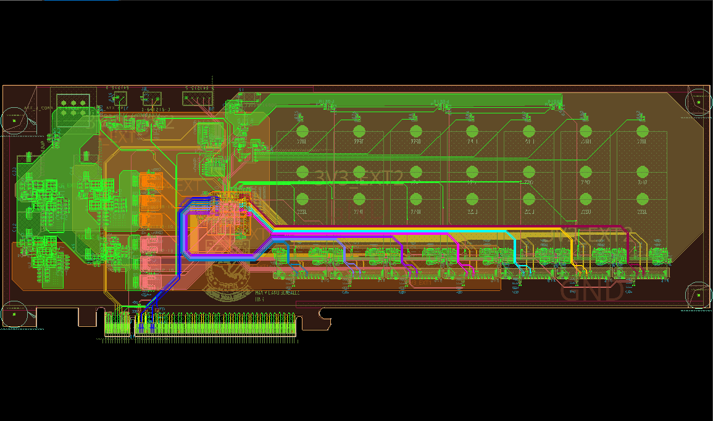
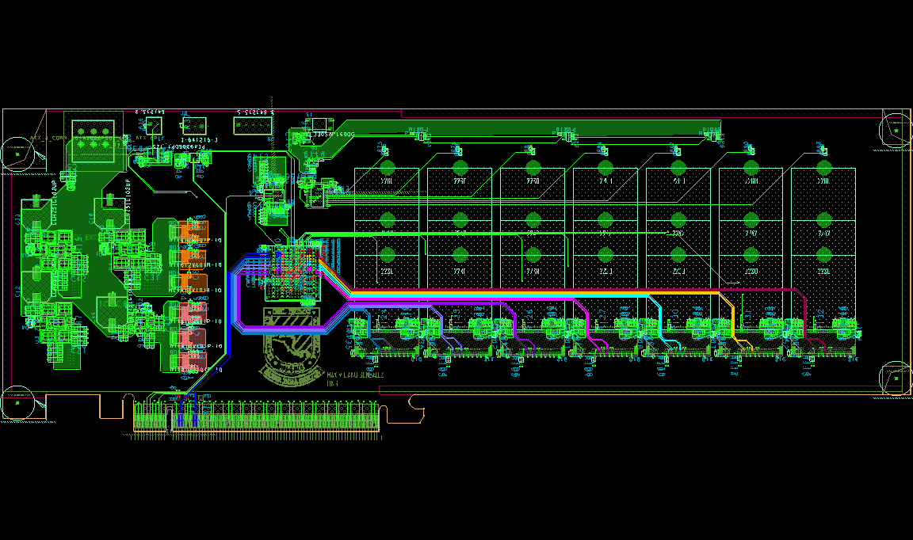
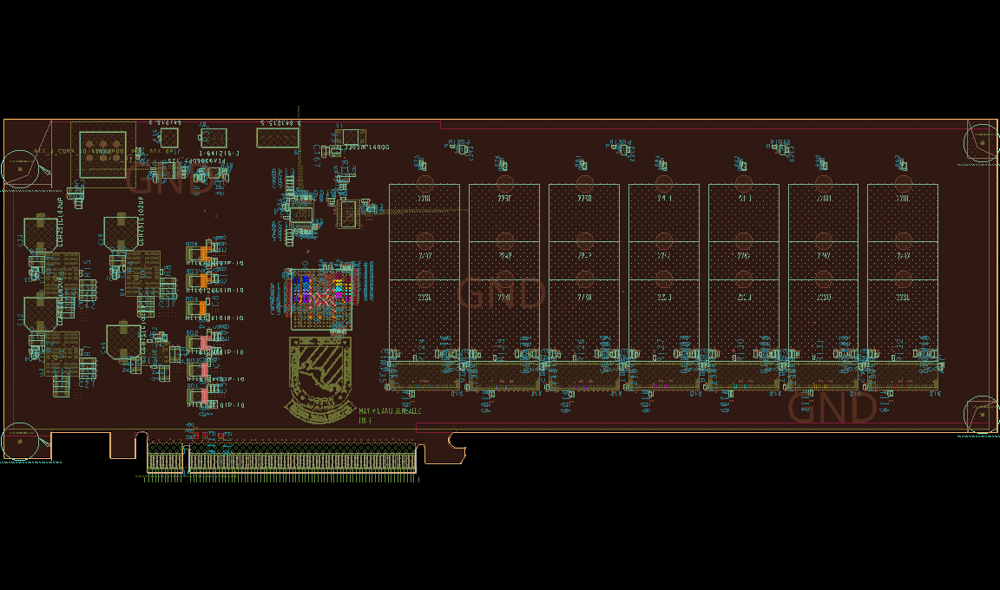
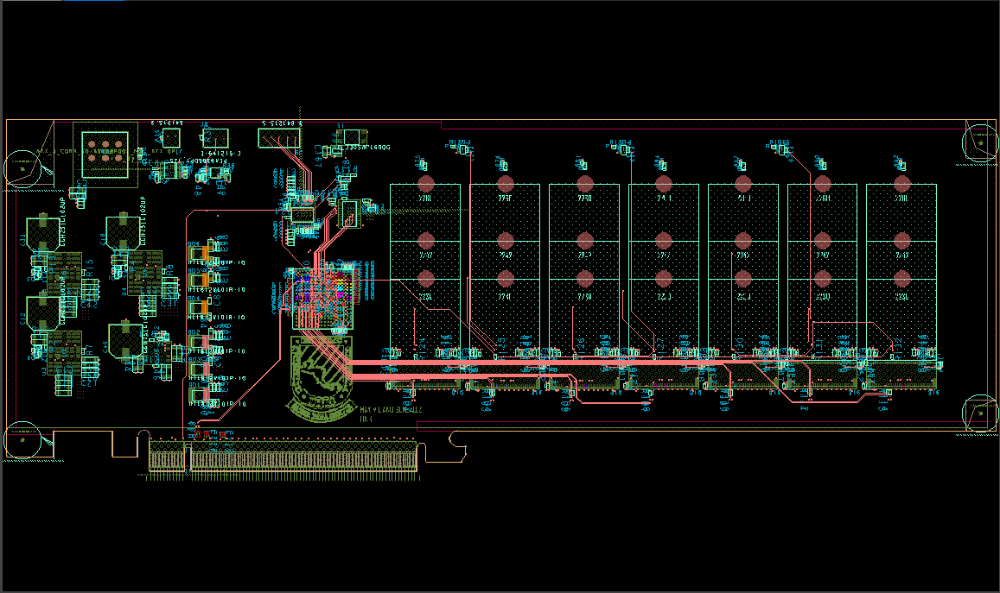
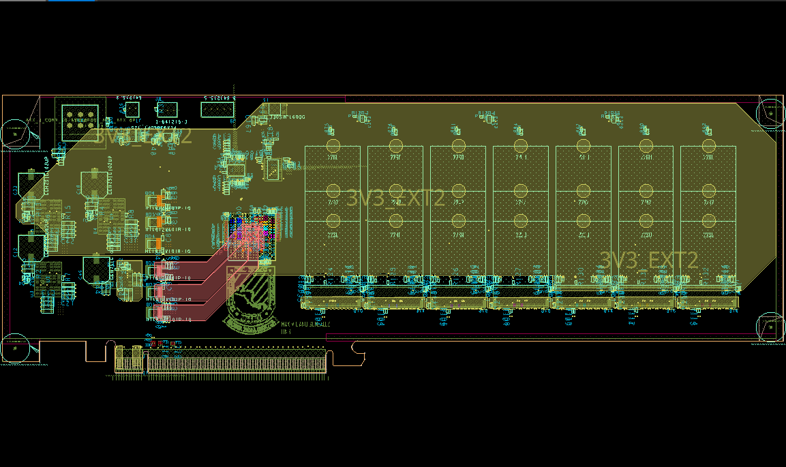
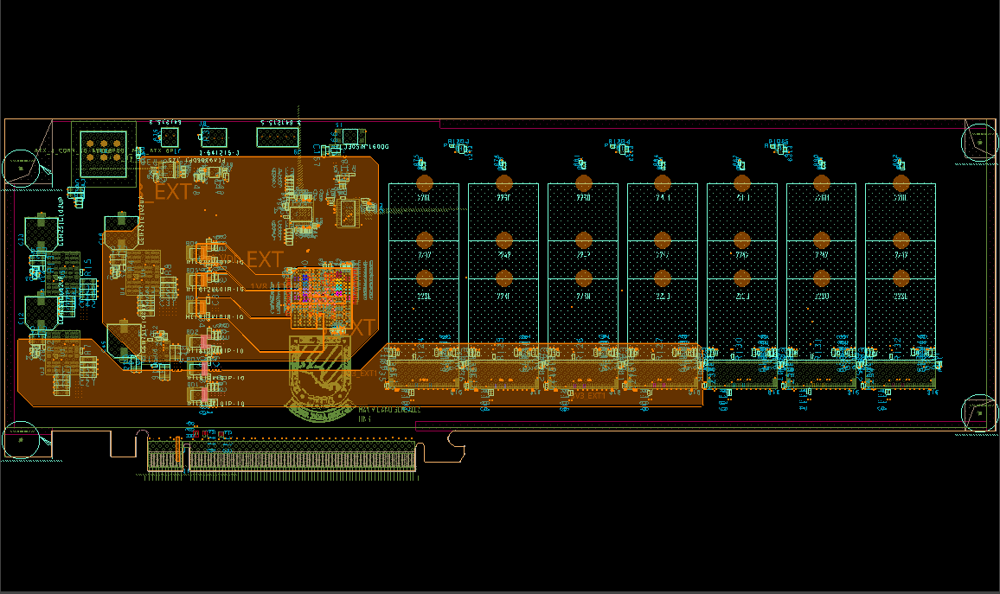
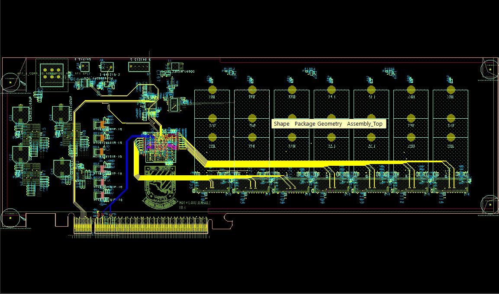
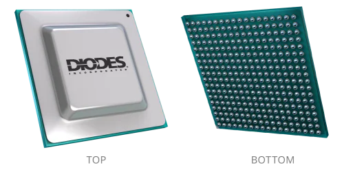
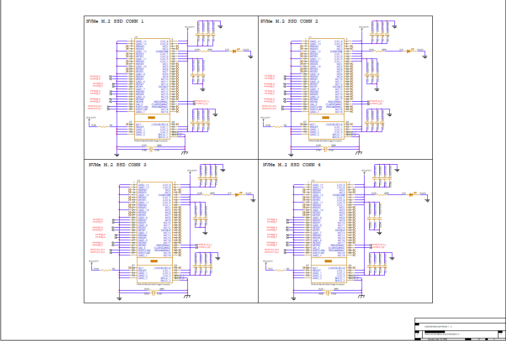
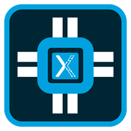

# Proyecto Final de Electrónica 2 y Diseño Electrónico 1 - PCIe to NVMe M.2 SSD Switch

<p align="center">
  <em>Universidad del Istmo de Guatemala</em><br>
  <em>Facultad de Ingeniería</em><br>
  <em>Proyecto Final</em><br>
  <em>Electrónica 2 y Diseño Electrónico 1</em>
</p>

<div align="center">
  
</div>

<p align="center">
  <em>Maximiliano González</em><br>
  <em>mayo de 2026</em>
</p>

## Descripción general

<div align="center">
  
</div>

Este repositorio documenta el diseño de una tarjeta personalizada con **switch PCIe Gen 3 para expansión de SSDs NVMe M.2**. El objetivo del proyecto es tomar una conexión PCIe desde el host y distribuirla mediante un switch PCIe para conectar varios SSDs NVMe M.2 en una sola tarjeta.

La tarjeta se desarrolló como proyecto final de electrónica y se enfoca en el trabajo práctico necesario para un sistema PCIe de alta velocidad: captura esquemática, diseño del árbol de potencia, planeación de carriles PCIe, distribución del reloj de referencia, manejo de reset/wake/presence, bus SMBus/I2C, conectores M.2, restricciones de layout, stack-up e integración mecánica. Es importante notar que no el diseno final **no** soporta **hot plug**.

## Tabla de Contenido

- [Versión en Español](#switch-pcie-a-nvme-m2-ssd)
  - [Descripción general](#descripción-general)
  - [Project Images](#project-images)
    - [Top Layer](#top-layer)
    - [GND02 Layer](#gnd02-layer)
    - [ART03 Layer](#art03-layer)
    - [ART04 Layer](#art04-layer)
    - [PWR05 Layer](#pwr05-layer)
    - [Bottom Layer](#bottom-layer)
  - [Chip PCIe principal](#chip-pcie-principal)
  - [Objetivos del proyecto](#objetivos-del-proyecto)
  - [Arquitectura general](#arquitectura-general)
  - [Bloques principales del diseño](#bloques-principales-del-diseño)
    - [1. Interfaz PCIe upstream](#1-interfaz-pcie-upstream)
    - [2. Núcleo del switch PCIe](#2-núcleo-del-switch-pcie)
    - [3. Puertos downstream M.2 NVMe](#3-puertos-downstream-m2-nvme)
    - [4. Administración SMBus / I2C](#4-administración-smbus--i2c)
    - [5. Straps de configuración](#5-straps-de-configuración)
    - [6. Arquitectura de potencia](#6-arquitectura-de-potencia)
    - [7. Señales de reset, wake y presence](#7-señales-de-reset-wake-y-presence)
    - [8. Reloj de referencia](#8-reloj-de-referencia)
    - [9. Layout y restricciones de PCB](#9-layout-y-restricciones-de-pcb)
    - [10. Diseño mecánico](#10-diseño-mecánico)
  - [Filosofía de diseño](#filosofía-de-diseño)
  - [Herramientas utilizadas](#herramientas-utilizadas)
  - [Contenido sugerido del repositorio](#contenido-sugerido-del-repositorio)
  - [Estado actual](#estado-actual)
  - [Notas](#notas)

## Imagenes del proyecto

### Top Layer

<div align="center">
  
</div>

### GND02 Layer

<div align="center">
  
</div>

### ART03 Layer

<div align="center">
  
</div>

### ART04 Layer

<div align="center">
  
</div>

### PWR05 Layer

<div align="center">
  
</div>

### BOTTOM Layer

<div align="center">
  
</div>

## Chip PCIe principal

<div align="center">
  
</div>

El diseño está basado en el **Diodes Incorporated PI7C9X3G816GP**, un switch PCI Express Gen 3. En este proyecto, el switch se usa para conectar una interfaz PCIe upstream con varios puertos downstream para SSDs NVMe M.2.

Características relevantes usadas en este proyecto:

- Conmutación PCIe Gen 3 para expansión de almacenamiento NVMe.
- Configuración de puertos y carriles mediante los straps `PORTCFG_x[2:0]`.
- Particionamiento del switch mediante `SWP_MODE[1:0]`.
- Modo normal de operación con `CHIPMODE[1:0] = 00`.
- Operación con un solo reloj de referencia usando `CKMODE = 0` / modo BASE.
- Selección de SMBus o I2C mediante `SMBUS_EN_L`.
- Opción de JTAG/boundary scan mediante `JTAG_SEL_L`.
- Señales relacionadas con hot-plug y administración de bajo consumo revisadas, pero no usadas como modo principal de operación para la tarjeta M.2.

## Objetivos del proyecto

- Diseñar una tarjeta PCIe Gen 3 capaz de conectar múltiples SSDs NVMe M.2.
- Usar un formato mecánico tipo tarjeta PCIe full-height.
- Seguir el esquemático de referencia/EVB de Diodes donde sea útil, simplificando las partes que no son necesarias para el diseño final.
- Mantener los straps de configuración en estados definidos, sin pines flotantes.
- Usar modos habilitados por defecto con resistores DNP donde sea útil para depuración o cambios futuros.
- Crear una PCB manufacturable en Cadence OrCAD/Allegro.

## Arquitectura general

```text
Conector PCIe al host
        |
        | Enlace PCIe Gen 3 upstream
        |
+-----------------------------+
| Diodes PI7C9X3G816GP        |
| Switch PCIe Gen 3           |
+-----------------------------+
        |
        | Enlaces PCIe Gen 3 downstream
        |
+-------+-------+-------+----------------+
| M.2 1 | M.2 2 | M.2 3 | ... SSDs NVMe  |
+-------+-------+-------+----------------+
```

El switch recibe el enlace PCIe upstream desde el host y distribuye enlaces PCIe downstream hacia los conectores M-key M.2 NVMe. Cada conector SSD usa carriles PCIe, reloj de referencia, reset, presence, wake y señales relacionadas con SMBus/I2C según los requerimientos de M.2 y PCIe.

## Bloques principales del diseño

<div align="center">
  
</div>

### 1. Interfaz PCIe upstream

La interfaz upstream conecta la tarjeta al sistema host mediante el conector PCIe edge. Esta sección incluye los pares diferenciales PCIe TX/RX, el reloj de referencia, reset, señales de wake/presence y los rieles de alimentación provenientes del conector host.

### 2. Núcleo del switch PCIe

El PI7C9X3G816GP es el componente central de la tarjeta. El trabajo de diseño alrededor de este IC incluye:

- Seleccionar la configuración correcta de puertos/carriles para la cantidad de SSDs NVMe.
- Definir valores de resistores de strap para los pines de modo.
- Rutear pares diferenciales PCIe de alta velocidad con impedancia controlada.
- Administrar entradas y salidas de reloj de referencia.
- Agregar desacople local cerca de los pines de alimentación del switch.
- Separar y filtrar rieles según lo requerido por el diseño de referencia.

### 3. Puertos downstream M.2 NVMe

Los puertos downstream usan conectores M-key M.2 para SSDs NVMe. Cada puerto incluye:

- Pares diferenciales PCIe TX/RX.
- Par REFCLK.
- Señal de reset `PERST#`.
- Manejo de `PEWAKE#` / `WAKE#`.
- Manejo de `PRSNT#` o señales de presencia cuando aplique.
- Capacitores locales de bulk y desacople de alta frecuencia.

### 4. Administración SMBus / I2C

El proyecto incluye soporte SMBus/I2C en lugar de dejar el bus de administración sin usar.

El switch permite seleccionar SMBus o I2C usando `SMBUS_EN_L`:

- Alto: modo I2C.
- Bajo: modo SMBus.

El diseño mantiene esta selección configurable con resistores para permitir un valor por defecto y también modificaciones durante bring-up.

### 5. Straps de configuración

Varios pines de configuración del switch se fijan con resistores pull-up o pull-down. Las decisiones del proyecto incluyen:

| Grupo de señales | Intención del proyecto |
|---|---|
| `CHIPMODE[1:0]` | Modo normal de operación, `00`. |
| `PORTCFG_x[2:0]` | Configurado según la distribución deseada de carriles downstream. |
| `CKMODE` | Operación con un solo reloj de referencia / estilo BASE. |
| `I2C_ADDR[2:0]` | Dirección por defecto `000`. |
| `JTAG_SEL_L` | Opción configurable para JTAG/boundary scan. |
| `SMBUS_EN_L` | Opción configurable para seleccionar SMBus o I2C. |

La EVB de referencia usa configuración mediante DIP switches, pero este proyecto reemplaza ese enfoque con straps fijos y opciones DNP donde es práctico.

### 6. Arquitectura de potencia

La tarjeta usa rieles de entrada PCIe/ATX y reguladores point-of-load locales para generar los voltajes requeridos por el switch PCIe y los conectores M.2.

El trabajo de potencia incluyó:

- Distribución de entrada de 12 V.
- Riel de 3.3 V para SSDs M.2 y lógica auxiliar.
- Rieles de 1.8 V y otros voltajes de núcleo requeridos por el switch PCIe.
- Selección de módulos POL con inductor integrado cuando fue posible.
- Capacitores bulk en los rieles de 12 V y 3.3 V.
- Desacople cerámico de alta frecuencia cerca de pines de alimentación.
- Indicadores LED usando NMOS para indicar estado de rieles/señales.

### 7. Señales de reset, wake y presence

El proyecto revisó las señales laterales PCIe necesarias para funcionamiento correcto:

- `PERST#`: distribución de reset hacia el switch y los dispositivos downstream.
- `PEWAKE#` / `WAKE#`: señal de wake desde dispositivos downstream.
- `PRSNT#`: detección de presencia o comportamiento relacionado con el conector.
- `INTA_L / PM_L11_EN_L`: revisada como parte del diseño de referencia; no tratada como señal principal de hot-plug para el diseño M.2 simplificado.

### 8. Reloj de referencia

El diseño usa distribución del reloj de referencia PCIe de acuerdo con la configuración seleccionada de `CKMODE`. Para el enfoque por defecto de un solo reloj de referencia, los carriles del switch se alimentan desde una fuente de reloj común. El ruteo diferencial de REFCLK se trata como ruteo de alta velocidad y debe cumplir las restricciones de impedancia y matching usadas para pares de reloj PCIe.

### 9. Layout y restricciones de PCB

La tarjeta se implementa en Cadence Allegro/OrCAD. El trabajo importante de layout incluye:

- Ruteo de pares diferenciales PCIe Gen 3.
- Impedancia controlada para pares TX/RX y REFCLK.
- Matching intra-par para pares diferenciales.
- Matching entre carriles donde lo requiera el Constraint Manager.
- Reglas de necking cerca del breakout del BGA y conectores.
- Selección de vías para fanout BGA y transiciones de alta velocidad.
- Creación de route keep-in y package keep-in.
- Planeación de bracket/mecánica full-height PCIe.
- Uso de exportación/importación de geometría en Allegro cuando fue útil.

### 10. Diseño mecánico

El trabajo mecánico incluyó:

- Planeación del contorno tipo tarjeta PCIe add-in-card.
- Consideración de bracket/faceplate full-height.
- Tamaño y ubicación de mounting holes.
- Geometría de package keep-in y route keep-in.
- Ubicación de conectores M.2 y clearances para SSDs.
- Flujo de importación/conversión de DXF y board outline en Allegro.

## Filosofía de diseño

La tarjeta sigue la EVB de referencia donde tiene sentido, pero elimina complejidad innecesaria para el proyecto final. Los DIP switches se reemplazan con straps de resistores, las opciones de debug se mantienen solo donde son útiles, y el diseño se optimiza para el caso de uso principal: un host PCIe conectado a múltiples SSDs NVMe M.2 mediante un switch PCIe Gen 3.

El diseño enfatiza defaults de hardware determinísticos, ruteo limpio de alta velocidad, desacople adecuado y manufacturabilidad práctica.

## Herramientas utilizadas

- Cadence OrCAD Capture para el esquemático.

<div align="left">
  
</div>

- Cadence Allegro PCB Editor para layout.

<div align="left">
  
</div>

- Datasheet y documentación EVB del Diodes PI7C9X3G816GP como referencia.

<div align="left">
  
</div>

- Datasheets de fabricantes para reguladores, conectores, capacitores, resistores, MOSFETs y lógica.

## Contenido del repositorio

```text
```text
.
├── README(EN).md
├── README(ES).md
├── Schematic.pdf
├── BOARD TEMPLATE/
│   ├── CNV & DXF FILES/
│   └── PCIe_BOARD_TEMPLATE_FL.brd
├── BOM/
│   ├── BOM_PCIe_NVMe.BOM
│   └── BOM_PCIe_NVMe.BOM.xlsx
├── DRL/
│   └── pcie-nvme_rework2-1-6.drl
├── DSN & BRD/
│   ├── PCIE-NVME.DSN
│   └── pcie-nvme.brd
├── FOTOS/
│   ├── ART03L.png
│   ├── ART04L.png
│   ├── BOTTOML.png
│   ├── DIODES-logo.webp
│   ├── GND02L.png
│   ├── Logo_UNIS.png
│   ├── OrCAD-X-Capture.webp
│   ├── OrCAD-X-PCB_Editor-1.webp
│   ├── PCIe_NVMe_DOWNTREAM.png
│   ├── PCIe_NVMe_LAYOUT.png
│   ├── PI7C9X3G816GP.webp
│   ├── PWR05L.png
│   └── TOPL.png
├── GERBER/
│   ├── ART03L.art
│   ├── ART04L.art
│   ├── BOARD.art
│   ├── BOTTOML.art
│   ├── GND02L.art
│   ├── PASTEB.art
│   ├── PASTET.art
│   ├── PWR05L.art
│   ├── SILKB.art
│   ├── SILKT.art
│   ├── SOLDERB.art
│   ├── SOLDERT.art
│   └── TOPL.art
└── Referencias/
    ├── PI7C9X3G816GP-Design-kit-2.3.zip
    └── PI7C9X3G816GP-Support-kit-1.0.zip
```

## Estado actual

El trabajo del proyecto cubrió decisiones de esquemático, planeación de señales, selección de componentes, creación de footprints, configuración de restricciones en Allegro, planeación mecánica y guía de layout. La validación final debe incluir limpieza de DRC, verificación de impedancia con el stack-up seleccionado, revisión de todos los straps, revisión de secuencia de rieles y revisión completa de esquemático/layout antes de fabricación.

## Notas

Este proyecto es un diseño de hardware educativo. Antes de fabricar o usar la tarjeta con SSDs NVMe costosos, se deben revisar de forma independiente el ruteo de alta velocidad, los rieles de potencia, tiempos de reset, topología del reloj de referencia, pinouts de conectores y straps de configuración.
